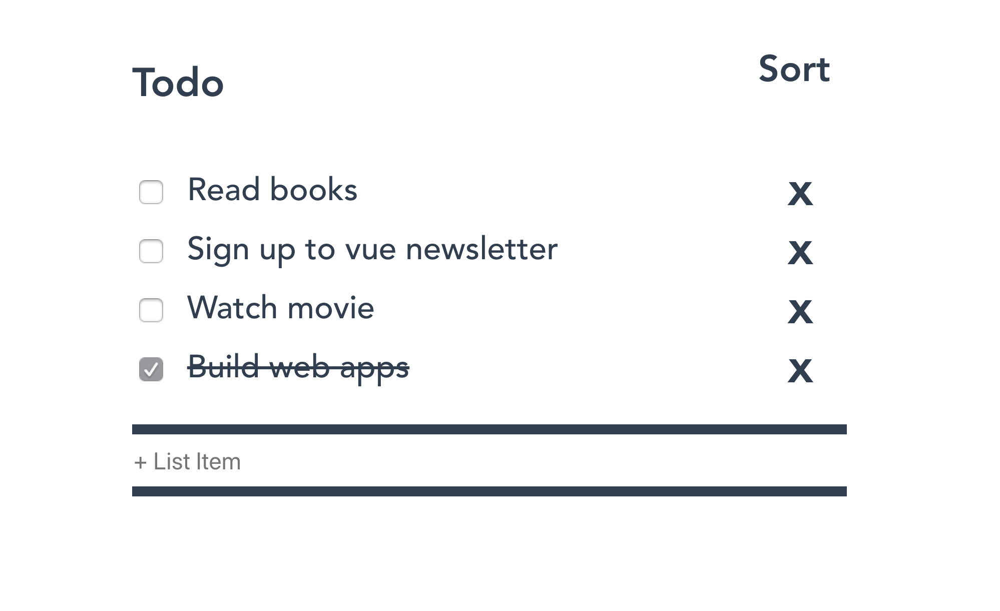

# Todo

1. Enter the to-do task and hit enter or click ouside the input box to save the entered task
2. To Edit the list, click on the list item, where the ui changes to edit filed and updated the task
3. To delete, click on the X mark of the respective list
4. To check the item as completed, click on the check box
5. To sort, click on the sort option on the top right



## Project setup
```
npm install
```

### Compiles and hot-reloads for development
```
npm run serve
```

### Compiles and minifies for production
```
npm run build
```

### Lints and fixes files
```
npm run lint
```

### Customize configuration
See [Configuration Reference](https://cli.vuejs.org/config/).
